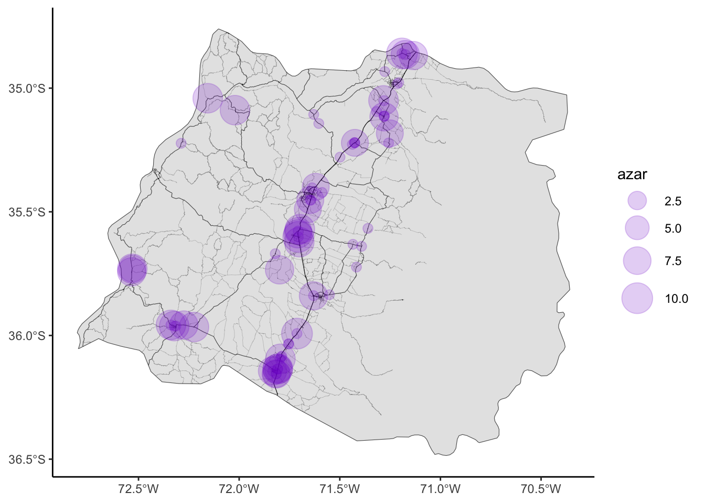

# Mapa en `{ggplot2}` con calles desde Open Street Map

En este tutorial crearemos un mapa de una región de Chile, y sobre el polígono geográfico aplicaremos otros elementos geográficos como calles, avenidas y carreteras, obtenidos desde Open Street Map (proveedor de mapas online abierto y comunitario). 

Esto puede servir para crear visualizaciones de datos espaciales minimalistas que de todos modos entreguen elementos urbanos de referencia para que les usuaries puedan ubicarse mejor espacialmente.

Usaremos `{dplyr}` para manipular los datos, el paquete `{ggplot2}` para visualización de datos, `{sf}` para tratamiento de elementos espaciales, `{rnaturalearth}` para obtener mapas de cualquier país o región del mundo, y `{osmdata}` para obtener datos estaciales desde Open Street Map (OSM) por medio de su API pública.

Accede al tutorial en este enlace: [Mapa en `{ggplot2}` con calles desde OpenStreetMap en R](https://rpubs.com/bastimapache/mapa_openstreetmap)

